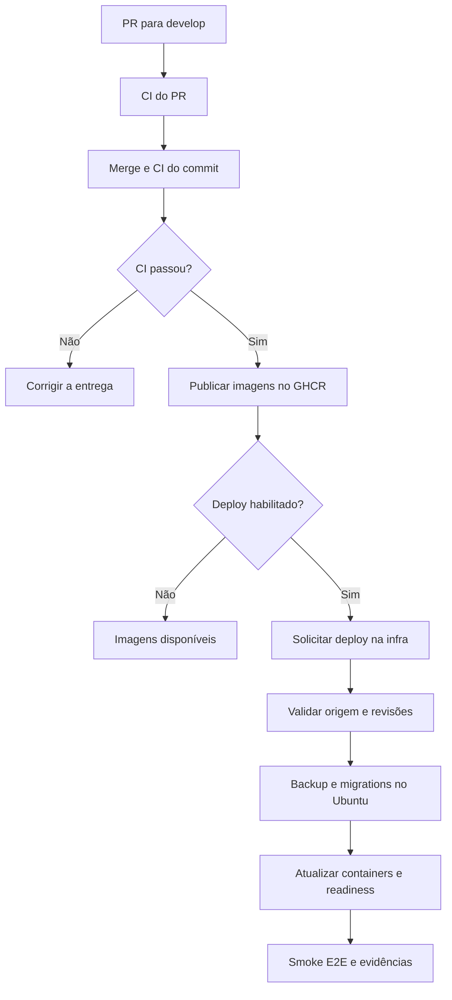

# Publicação e deploy — MVP Pastoral da Juventude

Versão: 1.7 · Atualizado em: 01/10/2026.

Este documento centraliza o fluxo técnico implementado nos repositórios backend,
frontend, infra e E2E. Os procedimentos específicos do host permanecem no
[runbook da infraestrutura](https://github.com/AuronForge/pastoral-juventude-infra/blob/develop/docs/DESENVOLVIMENTO.md).

## Situação e ambientes

Os PRs [backend #9](https://github.com/AuronForge/pastoral-juventude-backend/pull/9),
[frontend #15](https://github.com/AuronForge/pastoral-juventude-frontend/pull/15),
[E2E #2](https://github.com/AuronForge/pastoral-juventude-e2e/pull/2) e
[infra #2](https://github.com/AuronForge/pastoral-juventude-infra/pull/2) foram
mergeados. O primeiro deploy real no Ubuntu foi concluído em 01/10/2026,
com PostgreSQL, Redis, backend, frontend e Traefik prontos e três smoke tests
aprovados. A evidência e as revisões estão registradas abaixo. O dispatch automático de backend e frontend também foi validado em
01/10/2026, nas execuções registradas abaixo.

| Ambiente        | Branch      | Comportamento nesta entrega                                             |
| --------------- | ----------- | ----------------------------------------------------------------------- |
| Local           | `feature/*` | Desenvolvimento e testes antes do PR                                    |
| Desenvolvimento | `develop`   | CI, publicação por SHA e deploy no Ubuntu após ativação                 |
| Homologação     | `release`   | Branch prevista; promoção e deploy ainda não automatizados              |
| Produção        | `main`      | Branch prevista; publicação por tag disponível, deploy não automatizado |

No repositório `docs`, a documentação atualmente usa `main`; não existe
`develop`. Essa organização da documentação não dispara deploy da aplicação.

## Responsabilidade dos repositórios

| Repositório | Responsabilidade                                                              |
| ----------- | ----------------------------------------------------------------------------- |
| Backend     | API, migrations, contrato OpenAPI/Postman, testes e imagens da API/migrations |
| Frontend    | Aplicação React, design system, Storybook, testes e imagem web                |
| Infra       | Compose, preparação do host, validação da origem, backup, deploy e evidências |
| E2E         | Playwright, imagem de execução e smoke tests após implantação                 |
| Docs        | Fluxo integrado, decisões e referências operacionais oficiais                 |

## Fluxo de desenvolvimento



1. Desenvolver em branch e abrir PR para `develop`.
2. Revisar a alteração e aguardar os checks. Configurar proteção de branch para
   que a aprovação dos checks seja requisito de merge.
3. Após o merge, a CI executa novamente sobre o commit da `develop`.
4. `publish-development.yml` reage ao término bem-sucedido dessa CI, aceita
   somente evento `push` da `develop` no próprio repositório e faz checkout do
   SHA validado. PRs não publicam por esse fluxo.
5. Publicar as imagens com SHA completo. Quando `DEV_AUTO_DEPLOY=true`, enviar
   `workflow_dispatch` para a infra com `ref=develop`, `component` e `commit_sha`.
6. A infra valida a origem antes de agendar trabalho no Ubuntu.
7. O Ubuntu executa backup, migrations, atualização e smoke tests. Somente após
   sucesso o manifesto passa a representar a nova entrega validada.

Publicar uma imagem, enviar o dispatch e concluir o deploy são resultados diferentes.
O workflow da aplicação não aguarda nem certifica a conclusão do workflow da infra:
acompanhar ambos no GitHub Actions.

## Checks e testes

| Etapa          | Verificações implementadas                                                                                                      |
| -------------- | ------------------------------------------------------------------------------------------------------------------------------- |
| Backend CI     | Formatação, lint, Prisma, testes/cobertura mínima de 85%, build, consistência da documentação gerada, migrations em banco vazio |
| Backend Docker | Build da API, carregamento de Argon2/Prisma, build e CLI da imagem de migrations                                                |
| Frontend CI    | Formatação, lint, testes/cobertura mínima de 85%, build da aplicação e Storybook, build Docker                                  |
| Infra CI       | ShellCheck, Compose existente e de desenvolvimento, configurações de observabilidade, builds e teste real de inicialização/reinício do Redis                      |
| E2E CI         | Gates estáticos e build da imagem com inicialização do Chromium sem privilégios                                                 |
| Deploy         | Readiness dos serviços, readiness da API e smoke Playwright na rede interna                                                     |

A suíte smoke atual verifica página inicial, `/health/live` e `/health/ready`.
A execução real contra a aplicação acontece após o deploy ou por execução
manual/reutilizável da suíte. A CI de PR do E2E não executa esses testes contra
um ambiente implantado.

O login visual permanece no Storybook; o smoke não comprova autenticação.
Massa de usuários, integração da tela de login e outros fluxos funcionais são
entregas posteriores. O reset regressivo do backend exige usuários existentes.

## Imagens e publicação

| Artefato                   | Referência                                                                    |
| -------------------------- | ----------------------------------------------------------------------------- |
| Backend desenvolvimento    | `ghcr.io/auronforge/pastoral-juventude-backend:dev-<SHA completo>`            |
| Migrations desenvolvimento | `ghcr.io/auronforge/pastoral-juventude-backend:dev-<SHA completo>-migrations` |
| Frontend desenvolvimento   | `ghcr.io/auronforge/pastoral-juventude-frontend:dev-<SHA completo>`           |
| Backend/frontend release   | `ghcr.io/auronforge/pastoral-juventude-<componente>:<MAJOR.MINOR.PATCH>`      |
| Executor E2E no Ubuntu     | `pastoral-dev-e2e:<SHA E2E>`, construído localmente                           |

O SHA identifica a revisão de código; tags de registry não são tecnicamente
imutáveis. A implantação atual utiliza tags por SHA, sem pin por digest.
Não usar `latest` nem sobrescrever uma tag para representar outra revisão.

A publicação de release é independente: `publish-image.yml` reage a tags
`vMAJOR.MINOR.PATCH` e exige igualdade com a versão do `package.json`.
Esse workflow não encadeia a CI como gate nem implanta produção; antes de criar
uma tag, validar e aprovar a revisão pelo processo de release.
As novas publicações de desenvolvimento não substituem esse fluxo.

## Versionamento da API no gateway

A configuração proposta em [infra #5](https://github.com/AuronForge/pastoral-juventude-infra/pull/5)
declara cada versão suportada em um router específico do Traefik.
Depois do merge e de uma nova implantação:

| Entrada | Router/destino | Comportamento |
| --- | --- | --- |
| `/api/v1` e `/api/v1/...` | `backend-api-v1` → backend | Preservar caminho completo e query |
| `/api` sem versão | Nenhum router de API | HTTP 404 do gateway |
| `/api/v2/...` ou outra versão não declarada | Nenhum router de API | HTTP 404 do gateway |
| `/` e rotas web fora de `/api` | frontend | Aplicação web |

A regra da v1 combina caminho exato `/api/v1` e prefixo `/api/v1/`,
evitando que `/api/v10` corresponda à v1. O frontend exclui o espaço de
nomes da API, portanto não devolve a SPA para uma versão desconhecida.

Para v2 ou futuras versões, implementar e testar o contrato no backend e
adicionar um router explícito `backend-api-v2`, `backend-api-v3`, etc.
Cada router pode apontar ao mesmo serviço quando o backend implementar
ambas as versões, ou a serviços/containers separados. Não reescrever v2
para v1 nem publicar uma versão ainda não implementada.

Os arquivos `traefik/dynamic.development.yml` e `traefik/dynamic.yml`
mantêm a política. A CI da infra testa roteamento com Traefik real e servidores
HTTP de teste; isso valida o gateway, não os contratos funcionais da API.
Uma alteração exclusivamente na infra exige solicitar um novo deploy após
sua CI: o dispatch das aplicações é disparado pela publicação delas.

## Publicação do backend por túnel e frontend no Vercel

A topologia pública definida para desenvolvimento é frontend no Vercel e
backend no Ubuntu, publicado por Cloudflare Tunnel. O túnel deve apontar
somente à entrada de API do Traefik, não à entrada web que atende a SPA.

[Infra #6](https://github.com/AuronForge/pastoral-juventude-infra/pull/6)
introduz `api-public`, com porta 8082 no container e publicação apenas em
`127.0.0.1:${DEV_API_TUNNEL_PORT:-8082}` no host. Após merge e novo deploy:

```bash
cloudflared tunnel --url http://127.0.0.1:8082
```

| Entrada pública do túnel | Destino |
| --- | --- |
| `/api/v1` e `/api/v1/...` | Backend v1 |
| `/`, páginas web, healthchecks internos e versões não declaradas | HTTP 404 |

O frontend Docker continua como destino web interno e parte da suíte smoke;
isso não representa publicação no Vercel nem validação do frontend hospedado lá.
A CI da infra testa a entrada exclusiva da API, enquanto o E2E atual permanece
na rede interna. Validação externa e testes do frontend Vercel são uma próxima etapa.

Quick Tunnel não exige domínio e fornece URL HTTPS temporária. Encerrar o
processo encerra o acesso; iniciar outro túnel gera um hostname diferente.
O Vercel precisará ter seu destino atualizado quando a URL mudar. Para acesso
contínuo com endereço fixo, migrar para domínio e túnel nomeado.

A configuração `DEV_CORS_ORIGINS` aceita origens exatas separadas por vírgula
para clientes que chamem diretamente a API. Configurar somente domínios
aprovados e o localhost necessário. `DEV_PUBLIC_URL` não substitui essa
allowlist quando frontend e API estão em domínios diferentes.

Para o frontend no Vercel, recomenda-se encaminhar `/api/:path*` ao destino
externo `https://URL-DO-TUNEL/api/:path*` por rewrite, preservando a versão.
Assim o navegador chama `/api/v1/...` no domínio do frontend. O proxy do Vite
serve somente ao desenvolvimento local.

O backend atual emite refresh cookie HttpOnly com `SameSite=Lax`; somente
habilitar CORS não torna esse cookie utilizável em chamadas diretas entre sites.
O fluxo por proxy mantém a mesma origem no navegador. Habilitar
`COOKIE_SECURE=true` para o uso HTTPS e validar login/cookies no navegador
quando houver integração funcional. Não configurar URLs reais de Vercel/túnel
antes de obtê-las nem tratar autenticação como validada nesta entrega.

Fontes: [Quick Tunnels](https://developers.cloudflare.com/tunnel/get-started/quick-tunnels/)
e [rewrites externos do Vercel](https://vercel.com/docs/routing/rewrites).

## Saúde e diagnóstico de recursos

`GET /api/v1/health` na entrada `api-public` passa a usar o readiness
interno: HTTP 200 com `{"status":"ok","checks":{"database":"up","cache":"up"}}`,
ou HTTP 503 com a dependência em `down`. A resposta continua sem cache.
O router usa um serviço de diagnóstico próprio sem remover o backend por
readiness, permitindo informar a falha de dependência. Backend inacessível
ou falha do túnel pode gerar 502. O liveness interno permanece mínimo.

RAM do Ubuntu, swap, carga, disco, uptime, memória/CPU/I/O dos containers,
estado Docker, reinícios e OOM são coletados localmente:

```bash
sudo -u pastoral-runner python3 /opt/pastoral/dev/current/scripts/health-development.py
```

Requer novo deploy da infra, Python 3 e Docker local no Ubuntu. A memória
do PostgreSQL representa o container inteiro; não representa apenas
`shared_buffers` nem tamanho em disco. Os detalhes são locais, sem endpoint
público adicional. O relatório retorna código 1 em coleta parcial/falha e
mantém os dados disponíveis. Não configura alertas ou monitoramento contínuo.

A CI testa o coletor com Docker simulado e o roteamento HTTP 200/503 com
Traefik real. Após o deploy, validar o relatório no host real e a URL atual
do túnel. O [runbook](https://github.com/AuronForge/pastoral-juventude-infra/blob/develop/docs/DESENVOLVIMENTO.md)
define os campos, unidades, limites e comandos.

## Docker Desktop no Ubuntu

Por solicitação do responsável, foi preparada migração do projeto pastoral-dev
do Engine para Docker Desktop, para exibição na interface gráfica. São daemons
e armazenamentos distintos; mudar o contexto não transfere os volumes.

O [runbook Desktop](https://github.com/AuronForge/pastoral-juventude-infra/blob/develop/docs/DOCKER-DESKTOP.md)
define instalação da ACL persistente, novo deploy ainda no Engine, preflight,
janela de indisponibilidade, cópia de imagens/volumes com backup e smoke antes
de reabrir as portas públicas. Não migra Aquatrack nem desabilita o Engine.
O Desktop precisa permanecer ativo.

O arquivo /opt/pastoral/dev/docker-host seleciona explicitamente o daemon
para login GHCR, deploy e diagnóstico. Runtime/secrets usam volumes internos
no Desktop; E2E executa como UID 1001 e copia relatórios sem bind mounts.
Falha de acesso não provoca fallback para outro daemon.

A CI valida a portabilidade em Engine; a migração Desktop exige comprovação
no Ubuntu real. Dados de origem ficam antigos após a transferência: depois
de novas escritas, retorno requer preservar/restaurar os dados atualizados.
O novo deploy também corrige a cópia do script health-development.py à release
e registra resources.json nas evidências.

## Configuração e permissões

| Local            | Tipo/nome                                       | Uso                                           |
| ---------------- | ----------------------------------------------- | --------------------------------------------- |
| Backend/frontend | Variável `DEV_AUTO_DEPLOY`                      | `true` habilita o dispatch após publicação    |
| Backend/frontend | Secret `INFRA_DISPATCH_TOKEN`                   | Actions: write na infra para solicitar deploy |
| Infra            | Variável `DEV_DEPLOY_ENABLED`                   | `true` habilita validação/deploy na `develop` |
| Infra            | Variável `DEV_E2E_REF`                          | SHA completo aprovado da suíte E2E            |
| Infra            | Secret `SOURCE_READ_TOKEN`, se necessário       | Contents/Actions: read nas origens privadas   |
| Infra            | Variável `DEV_GHCR_PRIVATE`                     | `true` habilita login de leitura no GHCR      |
| Infra            | Variável `GHCR_USER` e secret `GHCR_READ_TOKEN` | Usuário e token com read:packages             |

As variáveis utilizadas no job `validate` precisam estar disponíveis no
repositório/organização; não configurá-las exclusivamente no Environment
`desenvolvimento`, que é associado somente ao job `deploy`.
O mesmo vale para `SOURCE_READ_TOKEN` quando a validação precisar dele.

O `GITHUB_TOKEN` publica no GHCR do próprio repositório. Para disparar o workflow
em outro repositório, usa-se `INFRA_DISPATCH_TOKEN`. Não gravar tokens, senhas ou
arquivos reais de ambiente em Git, documentos ou exemplos.

O runner usa labels `self-hosted, linux, x64, pastoral-dev` e o job de deploy
usa o Environment `desenvolvimento`. Builds e checks continuam nos runners do
GitHub. A infra é pública: restringir o runner com acesso ao Docker do host ao
workflow autorizado; uma label ou Environment isoladamente não impede outro
workflow de selecionar o runner. Se restrição por workflow não estiver disponível,
revisar a implantação para infra privada ou executor isolado antes de ativar.
Os detalhes estão no runbook.

## Primeiro deploy e ativação

1. Preparar o Ubuntu e o runner conforme o runbook; manter as variáveis de
   ativação desabilitadas durante essa preparação.
2. Garantir que `publish-development.yml` de backend/frontend e
   `deploy-development.yml` da infra existam também na branch padrão.
   O merge apenas em `develop` não resolve esse requisito de
   `workflow_run`/`workflow_dispatch`.
3. Iniciar novas CIs de push na `develop` das aplicações e aguardar a publicação.
4. Configurar `/opt/pastoral/dev/development.env` com imagens válidas de
   backend, frontend e migrations do mesmo SHA do backend.
5. Configurar secrets do host, permissões, Environment, variáveis/tokens e
   `DEV_E2E_REF`.
6. Confirmar a CI de push da infra para a revisão que será implantada.
7. Habilitar `DEV_DEPLOY_ENABLED` e executar `Deploy development` na
   `develop`, escolhendo componente e SHA publicado.
8. Verificar o ambiente e os artefatos. Só então habilitar `DEV_AUTO_DEPLOY`
   nas aplicações.

Exemplo de solicitação manual, com autenticação local do GitHub CLI e SHA real:

```bash
gh workflow run deploy-development.yml \
  --repo AuronForge/pastoral-juventude-infra \
  --ref develop \
  -f component=backend \
  -f commit_sha=SHA_COMPLETO_PUBLICADO
```

A infra exige o SHA atual da `develop` do componente, CI de push aprovada,
publicação aprovada correspondente, CI de push da própria infra aprovada e
existência do SHA E2E informado. A aprovação dessa revisão E2E é responsabilidade
de quem configura a variável; a validação atual não verifica sua CI automaticamente.

## Ativar e comprovar o deploy automático

Após o primeiro deploy manual validado:

1. Criar um personal access token **fine-grained**, com resource owner
   `AuronForge`, expiração definida (por exemplo, 30 dias), acesso somente ao
   repositório `pastoral-juventude-infra` e permissão de repositório
   **Actions: Read and write**. Metadata de leitura é incluído pelo GitHub.
   Se a organização exigir aprovação, aprovar antes de testar.
2. Salvar esse token como **Repository secret** `INFRA_DISPATCH_TOKEN` no backend
   e no frontend. Não usar Environment secret: o job de publicação não associa
   um Environment. Não reutilizar o token de leitura do GHCR para esse fim.
3. Nos dois repositórios, criar a **Repository variable** `DEV_AUTO_DEPLOY`
   com valor exato `true`, somente depois de salvar o secret.
4. Executar uma nova CI de push da `develop`, por merge ou reexecução de uma CI
   de push bem-sucedida do HEAD atual. A conclusão dispara a publicação.
5. Conferir `Request development deployment` na publicação e a nova execução
   `Deploy development` na infra. Confirmar SHA, componente, healthchecks, três
   smoke tests e artefatos. Validar backend e frontend separadamente.
6. Para suspender novas solicitações automáticas, definir `DEV_AUTO_DEPLOY=false`
   nas aplicações. Isso não cancela deploys já solicitados nem altera containers.
   Planejar a renovação do token antes da expiração.

O token de dispatch somente solicita a implantação; a infra continua validando
a origem e os checks antes de usar o runner. Publicação aprovada sem deploy
concluído não comprova a entrega. Não habilitar produção ou homologação por
essas variáveis.

## Evidência do primeiro deploy validado — 01/10/2026

[Execução 36895862793](https://github.com/AuronForge/pastoral-juventude-infra/actions/runs/36895862793),
na tentativa concluída às 14:11 BRT, após ajustar a porta do host. O job
`validate` e o job `deploy` passaram.

| Item | Revisão ou resultado |
| --- | --- |
| Infra | `d55ab698933537943c56e85329c9f39c5e501f01` |
| Backend e migrations | `d25052401f284fef01f7991fa8179753c3378fff` |
| Frontend | `27b8f16c98b0c5c08d0f0d88ee620e667ea3456e` |
| E2E | `0acd28590c6e05a3a7d701c22d86981f668002c9` |
| Migrations | 21 aplicadas na primeira tentativa; reexecução bem-sucedida |
| Smoke Playwright | Página inicial, backend vivo e backend pronto: 3 aprovados |
| Release no host | `/opt/pastoral/dev/releases/36895862793-20261001T170716Z` |
| Relatórios no host | `/opt/pastoral/dev/reports/36895862793-20261001T170716Z` |
| Artefato GitHub | `development-deployment-36895862793`, retenção de 14 dias |
| Porta de desenvolvimento no host | `DEV_HTTP_PORT=8081` |

O runner está instalado em `/opt/pastoral/runner`, executa como
`pastoral-runner` e está registrado como `eduardo-marques-server`, no grupo
`pastoral-dev`, com as labels exigidas pelo workflow.

Ocorrências resolvidas durante o bootstrap:

- `DEV_E2E_REF` indisponível no validate: configurado como Repository variable.
- HTTP 404 ao consultar origem: token `SOURCE_READ_TOKEN` configurado no
  repositório infra para leitura de Contents/Actions nas origens e na infra.
- Redis unhealthy: [infra #4](https://github.com/AuronForge/pastoral-juventude-infra/pull/4)
  corrigiu proprietário da configuração privada e recriação no reinício;
  CI passou com teste real em Docker.
- Conflito da porta 8080 com `aquatrack-traefik`: alterados
  `DEV_HTTP_PORT` e a porta de `DEV_PUBLIC_URL` no arquivo do host para 8081.
  O serviço Aquatrack permaneceu em execução.

As revisões acima documentam esse deploy, não os HEADs de entregas futuras.
O resultado comprova a infraestrutura e o smoke atual. Login funcional e
observabilidade completa ainda exigem suas validações específicas.

## Evidência do deploy automático — 01/10/2026

Após configurar `INFRA_DISPATCH_TOKEN` e `DEV_AUTO_DEPLOY=true` no backend
e frontend, foram reexecutadas CIs de push dos HEADs atuais da `develop`.
Elas passaram e geraram novas publicações. Os passos
`Request development deployment` concluíram com sucesso nos dois repositórios;
as implantações abaixo foram criadas por esse dispatch, sem solicitação manual
na infra.

| Componente | Publicação aprovada | Deploy automático aprovado | Smoke E2E |
| --- | --- | --- | --- |
| Frontend | [36899732586](https://github.com/AuronForge/pastoral-juventude-frontend/actions/runs/36899732586) | [36899770315](https://github.com/AuronForge/pastoral-juventude-infra/actions/runs/36899770315) | 3 testes aprovados |
| Backend/API e migrations | [36899777863](https://github.com/AuronForge/pastoral-juventude-backend/actions/runs/36899777863) | [36899985533](https://github.com/AuronForge/pastoral-juventude-infra/actions/runs/36899985533) | 3 testes aprovados |

Frontend concluído às 14:30 BRT e backend às 14:33 BRT. Os diretórios de
release/relatórios usam respectivamente os identificadores
`36899770315-20261001T172955Z` e `36899985533-20261001T173141Z`.
Os artefatos foram publicados nas duas execuções. As revisões de aplicação,
infra e E2E são as mesmas do primeiro deploy registrado acima: este teste
validou a ativação e o encadeamento automático, sem alterar código funcional.

O fluxo operacional está habilitado: merge em `develop` → CI aprovada →
publicação GHCR → dispatch → validação → Ubuntu → backup/migrations →
healthchecks → smoke E2E. O sucesso da publicação não substitui a conferência
do deploy. A suíte atual não comprova login funcional ou promoção de produção.

## Execução no Ubuntu e evidências

O Compose exclusivo de desenvolvimento usa projeto `pastoral-dev`, redes e
volumes próprios. Inicia Traefik, frontend, backend, PostgreSQL e Redis.
A implantação atual não inicia observabilidade completa, Funnel ou backup diário;
há backup antes de cada deploy, inclusive do banco inicial vazio.

O script serializa execuções com `flock`, carrega a configuração do host e o
manifesto da última entrega validada e altera só a referência do componente
solicitado. Copia as configurações para um diretório persistente, baixa imagens,
constrói Redis e aguarda PostgreSQL/Redis. Em seguida faz `pg_dump`, executa
`prisma migrate deploy`, atualiza os serviços e verifica readiness.

O E2E roda em container na rede `pastoral-dev_app`, com frontend em
`http://traefik` e backend em `http://backend:3000`. Healthchecks e bancos não
precisam ser publicados na Internet. A URL padrão de acesso é
`http://localhost:8080`; acesso LAN/HTTPS exige ajuste explícito do host.

| Caminho no host                         | Conteúdo                                |
| --------------------------------------- | --------------------------------------- |
| `/opt/pastoral/dev/development.env`     | Configuração inicial, fora do Git       |
| `/opt/pastoral/dev/secrets`             | Credenciais e chaves, fora do Git       |
| `/opt/pastoral/dev/releases`            | Configurações persistentes por execução |
| `/opt/pastoral/dev/backups`             | Dumps anteriores às migrations          |
| `/opt/pastoral/dev/reports`             | Relatórios e evidências locais          |
| `/opt/pastoral/dev/current-images.env`  | Últimas imagens validadas               |
| `/opt/pastoral/dev/previous-images.env` | Imagens da entrega validada anterior    |

Após sucesso, `deployment.txt` registra revisões da aplicação, infra e E2E,
além das imagens. Os artefatos do deploy ficam no GitHub por 14 dias. A limpeza
de releases, backups e relatórios no host ainda é manual.

## Falhas, recuperação e diagnóstico

| Sintoma                                    | Verificação                                                          |
| ------------------------------------------ | -------------------------------------------------------------------- |
| Imagem não publicada após merge            | Workflow na branch padrão, evento de CI de push e conclusão da CI    |
| Imagem publicada sem solicitação de deploy | `DEV_AUTO_DEPLOY` e token de dispatch                                |
| Validação/deploy pulados                   | Branch `develop` e `DEV_DEPLOY_ENABLED`                              |
| SHA rejeitado                              | HEAD atual da aplicação e execuções de CI/publicação correspondentes |
| Job aguardando runner                      | Serviço, labels, restrições e conectividade do runner                |
| Falha em pull                              | Referência publicada, visibilidade do pacote e autenticação GHCR     |
| Falha de migration                         | Logs, schema/baseline e dump gerado antes da execução                |
| Falha no E2E                               | Artefatos Playwright, readiness e SHA/configuração da suíte          |

Falhas interrompem a entrega e preservam o manifesto validado anterior.
Depois da atualização dos containers, uma falha de readiness/E2E pode deixar
a candidata em execução. Não há rollback automático da aplicação ou do banco.

Após falha da candidata, a recuperação usa `current-images.env`. Para reverter
uma entrega que chegou a passar, usa-se `previous-images.env`. Confirmar antes
que as imagens antigas são compatíveis com o schema atual. Não remover volumes
para corrigir deploy nem presumir que trocar imagens desfaz migrations.
Os comandos de recuperação e restauração estão no runbook e em
[OPERACAO.md](https://github.com/AuronForge/pastoral-juventude-infra/blob/develop/docs/OPERACAO.md).

## Fontes e manutenção

- [Publicação backend](https://github.com/AuronForge/pastoral-juventude-backend/blob/develop/.github/workflows/publish-development.yml).
- [Publicação frontend](https://github.com/AuronForge/pastoral-juventude-frontend/blob/develop/.github/workflows/publish-development.yml).
- [Workflow de deploy](https://github.com/AuronForge/pastoral-juventude-infra/blob/develop/.github/workflows/deploy-development.yml).
- [Script de deploy](https://github.com/AuronForge/pastoral-juventude-infra/blob/develop/scripts/deploy-development.sh).
- [Runbook Ubuntu](https://github.com/AuronForge/pastoral-juventude-infra/blob/develop/docs/DESENVOLVIMENTO.md).
- [Integração E2E](https://github.com/AuronForge/pastoral-juventude-e2e/blob/develop/docs/DEPLOY-DESENVOLVIMENTO.md).

Os workflows/scripts são a fonte executável do comportamento. Este documento
explica o fluxo integrado; o runbook mantém comandos específicos do host.
Mudanças em gates, triggers, imagens, permissões, bootstrap ou rollback devem
atualizar a documentação do repositório responsável e este guia no mesmo conjunto
de entregas. Registrar separadamente a evidência do primeiro deploy real.
