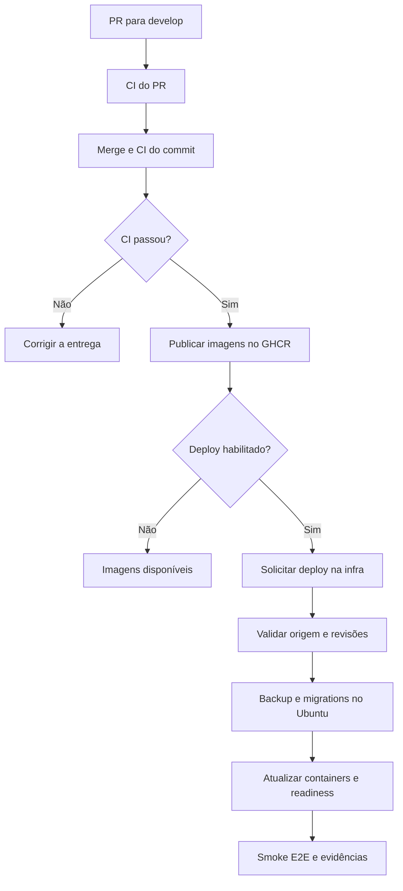

# Publicação e deploy — MVP Pastoral da Juventude

Versão: 1.0 · Atualizado em: 01/10/2026.

Este documento centraliza o fluxo técnico implementado nos repositórios backend,
frontend, infra e E2E. Os procedimentos específicos do host permanecem no
[runbook da infraestrutura](https://github.com/AuronForge/pastoral-juventude-infra/blob/develop/docs/DESENVOLVIMENTO.md).

## Situação e ambientes

Os PRs [backend #9](https://github.com/AuronForge/pastoral-juventude-backend/pull/9),
[frontend #15](https://github.com/AuronForge/pastoral-juventude-frontend/pull/15),
[E2E #2](https://github.com/AuronForge/pastoral-juventude-e2e/pull/2) e
[infra #2](https://github.com/AuronForge/pastoral-juventude-infra/pull/2) foram
mergeados. Isso disponibiliza a implementação; não comprova que o Ubuntu,
runner, secrets e variáveis já estejam configurados ou que o primeiro deploy tenha passado.

| Ambiente        | Branch      | Comportamento nesta entrega                                             |
| --------------- | ----------- | ----------------------------------------------------------------------- |
| Local           | `feature/*` | Desenvolvimento e testes antes do PR                                    |
| Desenvolvimento | `develop`   | CI, publicação por SHA e deploy no Ubuntu após ativação                 |
| Homologação     | `release`   | Branch prevista; promoção e deploy ainda não automatizados              |
| Produção        | `main`      | Branch prevista; publicação por tag disponível, deploy não automatizado |

No repositório `docs`, a documentação atualmente usa `main`; não existe
`develop`. Essa organização da documentação não dispara deploy da aplicação.

## Responsabilidade dos repositórios

| Repositório | Responsabilidade                                                              |
| ----------- | ----------------------------------------------------------------------------- |
| Backend     | API, migrations, contrato OpenAPI/Postman, testes e imagens da API/migrations |
| Frontend    | Aplicação React, design system, Storybook, testes e imagem web                |
| Infra       | Compose, preparação do host, validação da origem, backup, deploy e evidências |
| E2E         | Playwright, imagem de execução e smoke tests após implantação                 |
| Docs        | Fluxo integrado, decisões e referências operacionais oficiais                 |

## Fluxo de desenvolvimento



1. Desenvolver em branch e abrir PR para `develop`.
2. Revisar a alteração e aguardar os checks. Configurar proteção de branch para
   que a aprovação dos checks seja requisito de merge.
3. Após o merge, a CI executa novamente sobre o commit da `develop`.
4. `publish-development.yml` reage ao término bem-sucedido dessa CI, aceita
   somente evento `push` da `develop` no próprio repositório e faz checkout do
   SHA validado. PRs não publicam por esse fluxo.
5. Publicar as imagens com SHA completo. Quando `DEV_AUTO_DEPLOY=true`, enviar
   `workflow_dispatch` para a infra com `ref=develop`, `component` e `commit_sha`.
6. A infra valida a origem antes de agendar trabalho no Ubuntu.
7. O Ubuntu executa backup, migrations, atualização e smoke tests. Somente após
   sucesso o manifesto passa a representar a nova entrega validada.

Publicar uma imagem, enviar o dispatch e concluir o deploy são resultados diferentes.
O workflow da aplicação não aguarda nem certifica a conclusão do workflow da infra:
acompanhar ambos no GitHub Actions.

## Checks e testes

| Etapa          | Verificações implementadas                                                                                                      |
| -------------- | ------------------------------------------------------------------------------------------------------------------------------- |
| Backend CI     | Formatação, lint, Prisma, testes/cobertura mínima de 85%, build, consistência da documentação gerada, migrations em banco vazio |
| Backend Docker | Build da API, carregamento de Argon2/Prisma, build e CLI da imagem de migrations                                                |
| Frontend CI    | Formatação, lint, testes/cobertura mínima de 85%, build da aplicação e Storybook, build Docker                                  |
| Infra CI       | ShellCheck, Compose existente e de desenvolvimento, configurações de observabilidade e builds customizados                      |
| E2E CI         | Gates estáticos e build da imagem com inicialização do Chromium sem privilégios                                                 |
| Deploy         | Readiness dos serviços, readiness da API e smoke Playwright na rede interna                                                     |

A suíte smoke atual verifica página inicial, `/health/live` e `/health/ready`.
A execução real contra a aplicação acontece após o deploy ou por execução
manual/reutilizável da suíte. A CI de PR do E2E não executa esses testes contra
um ambiente implantado.

O login visual permanece no Storybook; o smoke não comprova autenticação.
Massa de usuários, integração da tela de login e outros fluxos funcionais são
entregas posteriores. O reset regressivo do backend exige usuários existentes.

## Imagens e publicação

| Artefato                   | Referência                                                                    |
| -------------------------- | ----------------------------------------------------------------------------- |
| Backend desenvolvimento    | `ghcr.io/auronforge/pastoral-juventude-backend:dev-<SHA completo>`            |
| Migrations desenvolvimento | `ghcr.io/auronforge/pastoral-juventude-backend:dev-<SHA completo>-migrations` |
| Frontend desenvolvimento   | `ghcr.io/auronforge/pastoral-juventude-frontend:dev-<SHA completo>`           |
| Backend/frontend release   | `ghcr.io/auronforge/pastoral-juventude-<componente>:<MAJOR.MINOR.PATCH>`      |
| Executor E2E no Ubuntu     | `pastoral-dev-e2e:<SHA E2E>`, construído localmente                           |

O SHA identifica a revisão de código; tags de registry não são tecnicamente
imutáveis. A implantação atual utiliza tags por SHA, sem pin por digest.
Não usar `latest` nem sobrescrever uma tag para representar outra revisão.

A publicação de release é independente: `publish-image.yml` reage a tags
`vMAJOR.MINOR.PATCH` e exige igualdade com a versão do `package.json`.
Esse workflow não encadeia a CI como gate nem implanta produção; antes de criar
uma tag, validar e aprovar a revisão pelo processo de release.
As novas publicações de desenvolvimento não substituem esse fluxo.

## Configuração e permissões

| Local            | Tipo/nome                                       | Uso                                           |
| ---------------- | ----------------------------------------------- | --------------------------------------------- |
| Backend/frontend | Variável `DEV_AUTO_DEPLOY`                      | `true` habilita o dispatch após publicação    |
| Backend/frontend | Secret `INFRA_DISPATCH_TOKEN`                   | Actions: write na infra para solicitar deploy |
| Infra            | Variável `DEV_DEPLOY_ENABLED`                   | `true` habilita validação/deploy na `develop` |
| Infra            | Variável `DEV_E2E_REF`                          | SHA completo aprovado da suíte E2E            |
| Infra            | Secret `SOURCE_READ_TOKEN`, se necessário       | Contents/Actions: read nas origens privadas   |
| Infra            | Variável `DEV_GHCR_PRIVATE`                     | `true` habilita login de leitura no GHCR      |
| Infra            | Variável `GHCR_USER` e secret `GHCR_READ_TOKEN` | Usuário e token com read:packages             |

As variáveis utilizadas no job `validate` precisam estar disponíveis no
repositório/organização; não configurá-las exclusivamente no Environment
`desenvolvimento`, que é associado somente ao job `deploy`.
O mesmo vale para `SOURCE_READ_TOKEN` quando a validação precisar dele.

O `GITHUB_TOKEN` publica no GHCR do próprio repositório. Para disparar o workflow
em outro repositório, usa-se `INFRA_DISPATCH_TOKEN`. Não gravar tokens, senhas ou
arquivos reais de ambiente em Git, documentos ou exemplos.

O runner usa labels `self-hosted, linux, x64, pastoral-dev` e o job de deploy
usa o Environment `desenvolvimento`. Builds e checks continuam nos runners do
GitHub. A infra é pública: restringir o runner com acesso ao Docker do host ao
workflow autorizado; uma label ou Environment isoladamente não impede outro
workflow de selecionar o runner. Se restrição por workflow não estiver disponível,
revisar a implantação para infra privada ou executor isolado antes de ativar.
Os detalhes estão no runbook.

## Primeiro deploy e ativação

1. Preparar o Ubuntu e o runner conforme o runbook; manter as variáveis de
   ativação desabilitadas durante essa preparação.
2. Garantir que `publish-development.yml` de backend/frontend e
   `deploy-development.yml` da infra existam também na branch padrão.
   O merge apenas em `develop` não resolve esse requisito de
   `workflow_run`/`workflow_dispatch`.
3. Iniciar novas CIs de push na `develop` das aplicações e aguardar a publicação.
4. Configurar `/opt/pastoral/dev/development.env` com imagens válidas de
   backend, frontend e migrations do mesmo SHA do backend.
5. Configurar secrets do host, permissões, Environment, variáveis/tokens e
   `DEV_E2E_REF`.
6. Confirmar a CI de push da infra para a revisão que será implantada.
7. Habilitar `DEV_DEPLOY_ENABLED` e executar `Deploy development` na
   `develop`, escolhendo componente e SHA publicado.
8. Verificar o ambiente e os artefatos. Só então habilitar `DEV_AUTO_DEPLOY`
   nas aplicações.

Exemplo de solicitação manual, com autenticação local do GitHub CLI e SHA real:

```bash
gh workflow run deploy-development.yml \
  --repo AuronForge/pastoral-juventude-infra \
  --ref develop \
  -f component=backend \
  -f commit_sha=SHA_COMPLETO_PUBLICADO
```

A infra exige o SHA atual da `develop` do componente, CI de push aprovada,
publicação aprovada correspondente, CI de push da própria infra aprovada e
existência do SHA E2E informado. A aprovação dessa revisão E2E é responsabilidade
de quem configura a variável; a validação atual não verifica sua CI automaticamente.

## Execução no Ubuntu e evidências

O Compose exclusivo de desenvolvimento usa projeto `pastoral-dev`, redes e
volumes próprios. Inicia Traefik, frontend, backend, PostgreSQL e Redis.
A implantação atual não inicia observabilidade completa, Funnel ou backup diário;
há backup antes de cada deploy, inclusive do banco inicial vazio.

O script serializa execuções com `flock`, carrega a configuração do host e o
manifesto da última entrega validada e altera só a referência do componente
solicitado. Copia as configurações para um diretório persistente, baixa imagens,
constrói Redis e aguarda PostgreSQL/Redis. Em seguida faz `pg_dump`, executa
`prisma migrate deploy`, atualiza os serviços e verifica readiness.

O E2E roda em container na rede `pastoral-dev_app`, com frontend em
`http://traefik` e backend em `http://backend:3000`. Healthchecks e bancos não
precisam ser publicados na Internet. A URL padrão de acesso é
`http://localhost:8080`; acesso LAN/HTTPS exige ajuste explícito do host.

| Caminho no host                         | Conteúdo                                |
| --------------------------------------- | --------------------------------------- |
| `/opt/pastoral/dev/development.env`     | Configuração inicial, fora do Git       |
| `/opt/pastoral/dev/secrets`             | Credenciais e chaves, fora do Git       |
| `/opt/pastoral/dev/releases`            | Configurações persistentes por execução |
| `/opt/pastoral/dev/backups`             | Dumps anteriores às migrations          |
| `/opt/pastoral/dev/reports`             | Relatórios e evidências locais          |
| `/opt/pastoral/dev/current-images.env`  | Últimas imagens validadas               |
| `/opt/pastoral/dev/previous-images.env` | Imagens da entrega validada anterior    |

Após sucesso, `deployment.txt` registra revisões da aplicação, infra e E2E,
além das imagens. Os artefatos do deploy ficam no GitHub por 14 dias. A limpeza
de releases, backups e relatórios no host ainda é manual.

## Falhas, recuperação e diagnóstico

| Sintoma                                    | Verificação                                                          |
| ------------------------------------------ | -------------------------------------------------------------------- |
| Imagem não publicada após merge            | Workflow na branch padrão, evento de CI de push e conclusão da CI    |
| Imagem publicada sem solicitação de deploy | `DEV_AUTO_DEPLOY` e token de dispatch                                |
| Validação/deploy pulados                   | Branch `develop` e `DEV_DEPLOY_ENABLED`                              |
| SHA rejeitado                              | HEAD atual da aplicação e execuções de CI/publicação correspondentes |
| Job aguardando runner                      | Serviço, labels, restrições e conectividade do runner                |
| Falha em pull                              | Referência publicada, visibilidade do pacote e autenticação GHCR     |
| Falha de migration                         | Logs, schema/baseline e dump gerado antes da execução                |
| Falha no E2E                               | Artefatos Playwright, readiness e SHA/configuração da suíte          |

Falhas interrompem a entrega e preservam o manifesto validado anterior.
Depois da atualização dos containers, uma falha de readiness/E2E pode deixar
a candidata em execução. Não há rollback automático da aplicação ou do banco.

Após falha da candidata, a recuperação usa `current-images.env`. Para reverter
uma entrega que chegou a passar, usa-se `previous-images.env`. Confirmar antes
que as imagens antigas são compatíveis com o schema atual. Não remover volumes
para corrigir deploy nem presumir que trocar imagens desfaz migrations.
Os comandos de recuperação e restauração estão no runbook e em
[OPERACAO.md](https://github.com/AuronForge/pastoral-juventude-infra/blob/develop/docs/OPERACAO.md).

## Fontes e manutenção

- [Publicação backend](https://github.com/AuronForge/pastoral-juventude-backend/blob/develop/.github/workflows/publish-development.yml).
- [Publicação frontend](https://github.com/AuronForge/pastoral-juventude-frontend/blob/develop/.github/workflows/publish-development.yml).
- [Workflow de deploy](https://github.com/AuronForge/pastoral-juventude-infra/blob/develop/.github/workflows/deploy-development.yml).
- [Script de deploy](https://github.com/AuronForge/pastoral-juventude-infra/blob/develop/scripts/deploy-development.sh).
- [Runbook Ubuntu](https://github.com/AuronForge/pastoral-juventude-infra/blob/develop/docs/DESENVOLVIMENTO.md).
- [Integração E2E](https://github.com/AuronForge/pastoral-juventude-e2e/blob/develop/docs/DEPLOY-DESENVOLVIMENTO.md).

Os workflows/scripts são a fonte executável do comportamento. Este documento
explica o fluxo integrado; o runbook mantém comandos específicos do host.
Mudanças em gates, triggers, imagens, permissões, bootstrap ou rollback devem
atualizar a documentação do repositório responsável e este guia no mesmo conjunto
de entregas. Registrar separadamente a evidência do primeiro deploy real.
