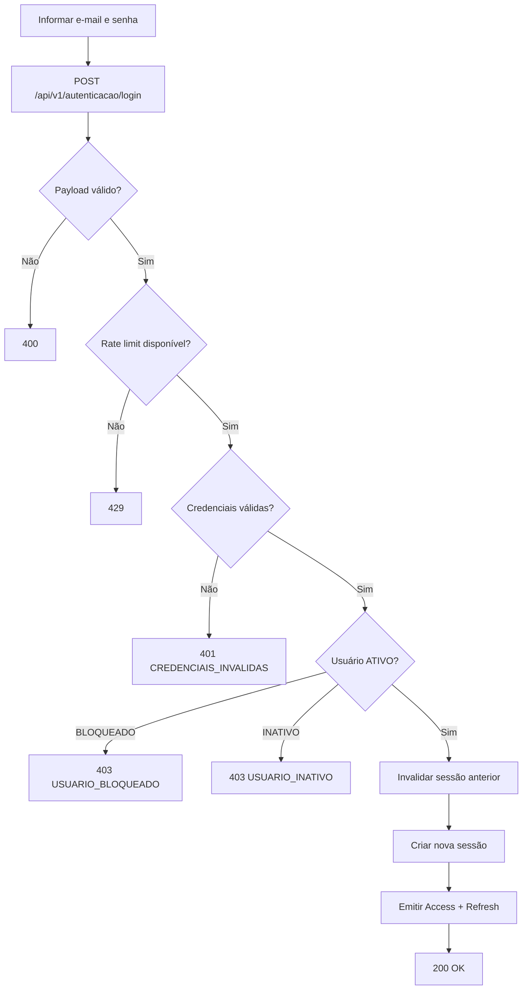

# RES-001 — Casos de Uso e Fluxos — Autenticar usuário

**Versão:** 1.1

---

## UC-AUT-001 — Autenticar usuário com senha definitiva

### Ator

Usuário cadastrado e ativo.

### Pré-condições

- `USUARIO.status = ATIVO`;
- `troca_senha_obrigatoria = false`;
- senha definitiva válida.

### Fluxo principal

1. Usuário informa e-mail e senha.
2. Frontend envia `POST /api/v1/autenticacao/login`.
3. Backend normaliza e-mail.
4. Backend valida rate limit.
5. Backend valida credenciais.
6. Backend invalida sessão ativa anterior, se houver.
7. Backend cria nova sessão.
8. Backend emite Access Token e Refresh Token.
9. Backend registra auditoria.
10. Frontend recebe Access Token e entra na área autenticada.

### Pós-condições

- apenas uma sessão ativa;
- cookie de Refresh Token configurado;
- `ultimo_login` atualizado.

---

## UC-AUT-002 — Primeiro acesso / senha temporária válida

### Ator

Usuário com `troca_senha_obrigatoria = true`.

### Fluxo principal

1. Usuário informa e-mail e senha temporária.
2. Backend valida hash e expiração.
3. Backend não cria sessão normal.
4. Backend emite token `TROCA_SENHA`.
5. Frontend direciona para alteração de senha.

### Pós-condições

- nenhuma sessão normal;
- nenhum cookie de Refresh Token;
- token restrito válido por 15 minutos.

---

## UC-AUT-003 — Credencial inválida

1. Usuário informa credencial inválida.
2. Sistema contabiliza tentativa.
3. Sistema registra `LOGIN_FALHA`.
4. Sistema retorna `401 CREDENCIAIS_INVALIDAS`.
5. Resposta não informa qual campo falhou.

---

## UC-AUT-004 — Usuário bloqueado

1. Credencial corresponde ao usuário.
2. Backend detecta `BLOQUEADO`.
3. Nenhuma sessão é criada.
4. Retorna `403 USUARIO_BLOQUEADO`.

---

## UC-AUT-005 — Usuário inativo

1. Credencial corresponde ao usuário.
2. Backend detecta `INATIVO`.
3. Nenhuma sessão é criada.
4. Retorna `403 USUARIO_INATIVO`.

---

## UC-AUT-006 — Rate limit excedido

1. Usuário/login atinge 5 tentativas inválidas em 15 minutos.
2. Backend bloqueia novas tentativas por 15 minutos.
3. Nova chamada retorna `429 LIMITE_TENTATIVAS_EXCEDIDO`.

---

## UC-AUT-007 — Senha temporária expirada

1. Usuário informa senha temporária.
2. Backend identifica expiração.
3. Nenhuma sessão é criada.
4. Retorna `401 SENHA_TEMPORARIA_EXPIRADA`.
5. Usuário precisa iniciar nova recuperação.

---

## UC-AUT-008 — Concorrência de dois logins

1. Duas requisições válidas chegam praticamente simultâneas.
2. A persistência impede duas sessões ativas.
3. O processamento converge para apenas uma sessão ativa.
4. Qualquer sessão substituída deixa de ser aceita.
