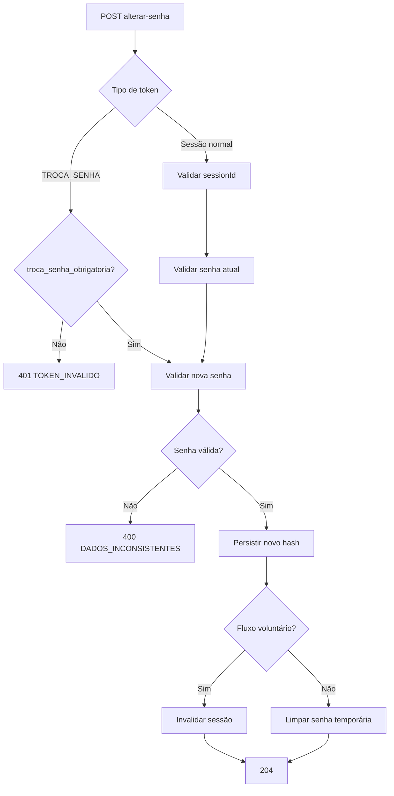

# RES-002 — Casos de Uso e Fluxos — Alterar senha

**Versão:** 1.1

---

## UC-AUT-009 — Definir senha definitiva no primeiro acesso

### Ator

Usuário com token `TROCA_SENHA`.

### Fluxo

1. Usuário informa nova senha e confirmação.
2. Frontend envia token restrito.
3. Backend valida token.
4. Backend confirma `troca_senha_obrigatoria=true`.
5. Backend valida política de senha.
6. Backend persiste novo hash.
7. Backend limpa dados temporários.
8. Backend marca troca obrigatória como concluída.
9. Backend retorna 204.
10. Usuário é direcionado ao login.

---

## UC-AUT-010 — Alterar senha voluntariamente

### Ator

Usuário autenticado com sessão normal.

### Fluxo

1. Usuário informa senha atual, nova senha e confirmação.
2. Backend valida Access Token e sessão.
3. Backend valida senha atual.
4. Backend valida nova senha.
5. Backend persiste novo hash.
6. Backend invalida sessão e Refresh Token.
7. Backend retorna 204.
8. Frontend encerra sessão local.
9. Usuário realiza novo login.

---

## UC-AUT-011 — Reutilizar token de troca já consumido

1. Usuário já concluiu troca obrigatória.
2. Tenta reutilizar o mesmo token ainda criptograficamente não expirado.
3. Backend consulta estado persistido.
4. `troca_senha_obrigatoria=false`.
5. Backend retorna `401 TOKEN_INVALIDO`.
6. Senha não é alterada novamente.

---

## UC-AUT-012 — Usuário bloqueado conclui recuperação

1. Usuário está `BLOQUEADO`.
2. Possui token `TROCA_SENHA` válido obtido pelo fluxo de recuperação.
3. Altera senha com sucesso.
4. Backend mantém `status=BLOQUEADO`.
5. Nenhuma sessão é criada.
6. Novo login continua retornando `USUARIO_BLOQUEADO`.

---

## UC-AUT-013 — Senha atual inválida

1. Usuário possui sessão válida.
2. Informa senha atual incorreta.
3. Backend não altera senha.
4. Sessão permanece válida.
5. Retorna `401 CREDENCIAIS_INVALIDAS`.

---

## UC-AUT-014 — Nova senha inválida

1. Usuário informa nova senha que viola regra de comprimento/espaços/confirmacao.
2. Backend rejeita com `400 DADOS_INCONSISTENTES`.
3. Nenhum hash é modificado.
4. Nenhuma sessão é invalidada.

