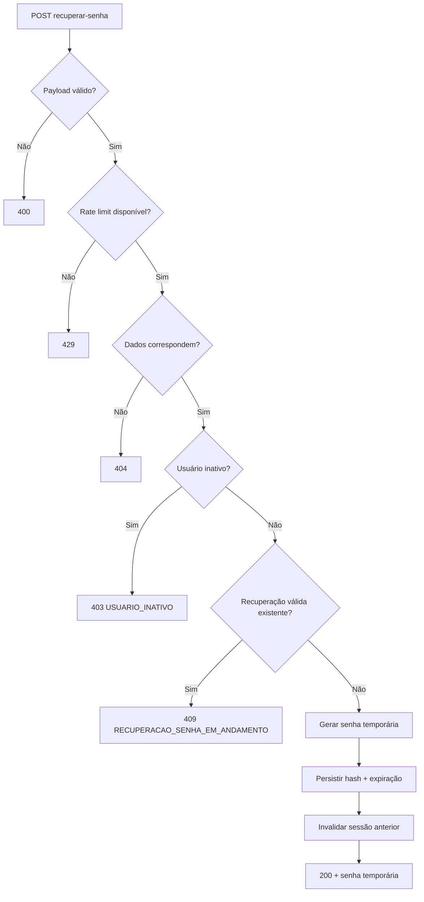

# RES-003 — Casos de Uso e Fluxos — Recuperar senha

**Versão:** 1.1

---

## UC-AUT-015 — Recuperar senha com dados válidos

### Ator

Usuário sem autenticação.

### Fluxo principal

1. Usuário informa nome, e-mail, data de nascimento e nome da paróquia.
2. Frontend envia `POST /api/v1/autenticacao/recuperar-senha`.
3. Backend valida payload e rate limit.
4. Backend normaliza os campos.
5. Backend confirma correspondência integral dos dados.
6. Backend verifica status.
7. Backend confirma ausência de recuperação válida em andamento.
8. Backend gera senha temporária.
9. Backend persiste apenas seu hash e expiração.
10. Backend define troca obrigatória.
11. Backend invalida sessão existente, se houver.
12. Backend registra auditoria.
13. Backend devolve senha temporária uma única vez.
14. Usuário segue para login.

### Pós-condições

- recuperação válida por 15 minutos;
- nenhuma sessão normal;
- sessão anterior invalidada;
- senha temporária só disponível na response atual.

---

## UC-AUT-016 — Dados não correspondem

1. Usuário fornece conjunto de dados que não corresponde integralmente.
2. Backend não informa qual campo divergiu.
3. Backend retorna `404 DADOS_RECUPERACAO_NAO_LOCALIZADOS`.
4. Nenhuma senha é criada.

---

## UC-AUT-017 — Recuperação já em andamento

1. Usuário possui senha temporária válida e não utilizada.
2. Solicita nova recuperação.
3. Backend detecta recuperação ativa.
4. Não gera nova senha.
5. Não reenvia senha anterior.
6. Retorna `409 RECUPERACAO_SENHA_EM_ANDAMENTO`.

---

## UC-AUT-018 — Recuperar senha de usuário bloqueado

1. Dados correspondem a usuário bloqueado.
2. Backend permite recuperação.
3. Gera nova senha temporária.
4. Mantém `status=BLOQUEADO`.
5. Invalida eventual sessão.
6. Retorna sucesso.

---

## UC-AUT-019 — Usuário inativo

1. Dados correspondem a usuário inativo.
2. Backend não gera senha temporária.
3. Retorna `403 USUARIO_INATIVO`.

---

## UC-AUT-020 — Rate limit excedido

1. São realizadas três tentativas de recuperação em 30 minutos.
2. O limite é atingido.
3. Nova tentativa durante o bloqueio é rejeitada.
4. Backend retorna `429 LIMITE_TENTATIVAS_EXCEDIDO`.

---

## UC-AUT-021 — Solicitações concorrentes

1. Duas requests válidas para o mesmo usuário chegam simultaneamente.
2. Backend garante exclusão lógica/transacional.
3. Apenas uma senha temporária fica válida.
4. A outra request não produz segunda recuperação válida.

