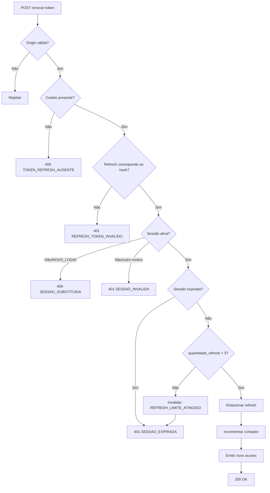

# RES-106 — Casos de Uso e Fluxos — Renovar Access Token

**Versão:** 1.1

---

## UC-AUT-022 — Renovar token com sucesso

### Ator

Usuário com sessão normal ativa.

### Fluxo principal

1. Navegador envia cookie `refresh_token`.
2. Backend valida origem.
3. Backend localiza sessão pelo hash.
4. Backend confirma sessão ativa e usuário ativo.
5. Backend confirma duração absoluta.
6. Backend confirma que ainda há renovação disponível.
7. Backend gera novo Refresh Token.
8. Backend substitui o hash persistido.
9. Incrementa `quantidade_refresh`.
10. Gera novo Access Token.
11. Backend envia novo cookie.
12. Retorna 200.

---

## UC-AUT-023 — Token anterior reutilizado

1. Refresh Token A é usado com sucesso.
2. Backend rotaciona para Refresh Token B.
3. Uma segunda request tenta reutilizar A.
4. Hash A já não corresponde ao persistido.
5. Backend retorna `401 REFRESH_TOKEN_INVALIDO`.

---

## UC-AUT-024 — Sessão atinge limite de renovação

1. Sessão já possui `quantidade_refresh = 3`.
2. Cliente tenta renovar novamente.
3. Backend invalida sessão com `REFRESH_LIMITE_ATINGIDO`.
4. Backend expira cookie.
5. Retorna `401 SESSAO_EXPIRADA`.
6. Usuário precisa fazer novo login.

---

## UC-AUT-025 — Sessão substituída

1. Usuário realizou novo login em outra janela/dispositivo.
2. Sessão antiga foi invalidada com `NOVO_LOGIN`.
3. Cliente antigo tenta renovar.
4. Backend retorna `409 SESSAO_SUBSTITUIDA`.
5. Cliente limpa estado local.

---

## UC-AUT-026 — Sessão absoluta expirada

1. `data_expiracao` da sessão foi atingida.
2. Cliente tenta renovar.
3. Backend não emite tokens.
4. Retorna `401 SESSAO_EXPIRADA`.

---

## UC-AUT-027 — Renovações concorrentes

1. Duas requests usam o mesmo Refresh Token.
2. Ambas chegam quase simultaneamente.
3. Atualização do hash é atômica.
4. Uma request vence e rotaciona o token.
5. A segunda falha com `REFRESH_TOKEN_INVALIDO`.

