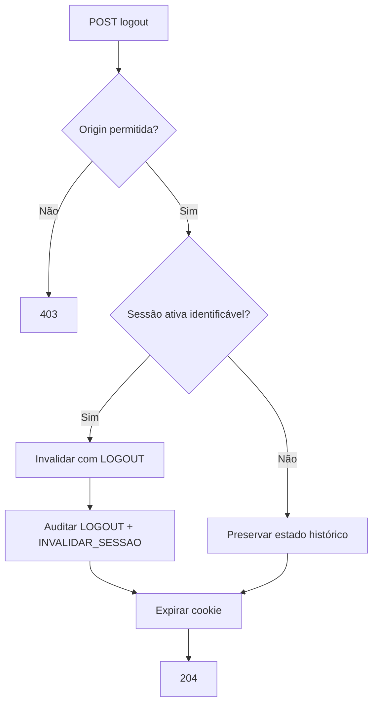

# RES-107 — Casos de Uso e Fluxos — Logout

**Versão:** 1.1

---

## UC-AUT-028 — Encerrar sessão ativa

### Ator

Usuário com sessão normal ativa.

### Fluxo

1. Usuário seleciona logout.
2. Frontend envia `POST /api/v1/autenticacao/logout`.
3. Backend resolve correlation id.
4. Backend valida origem.
5. Backend identifica sessão.
6. Backend invalida sessão com `LOGOUT`.
7. Backend invalida Refresh Token.
8. Backend registra auditoria.
9. Backend expira cookie.
10. Retorna 204.
11. Frontend limpa estado local.

---

## UC-AUT-029 — Logout repetido

1. Usuário já realizou logout.
2. Frontend ou retry envia nova chamada.
3. Backend não encontra sessão ativa a encerrar.
4. Backend expira cookie novamente.
5. Retorna 204.
6. Nenhum erro funcional é apresentado.

---

## UC-AUT-030 — Logout após novo login em outro local

1. Sessão antiga foi invalidada por `NOVO_LOGIN`.
2. Cliente antigo solicita logout.
3. Backend preserva o motivo histórico `NOVO_LOGIN`.
4. Expira cookie antigo.
5. Retorna 204.

---

## UC-AUT-031 — Logout após expiração de sessão

1. Sessão já expirou.
2. Cliente solicita logout.
3. Backend não reabre nem altera incorretamente a sessão.
4. Expira cookie.
5. Retorna 204.

---

## UC-AUT-032 — Logout concorrente

1. Duas requests de logout chegam para a mesma sessão.
2. Uma efetua a transição ativa → inativa.
3. Outra observa sessão já inativa.
4. Ambas retornam 204.
5. Auditoria de invalidação não é duplicada.

